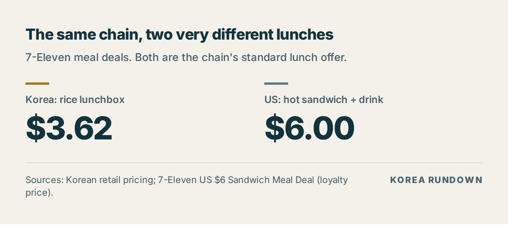
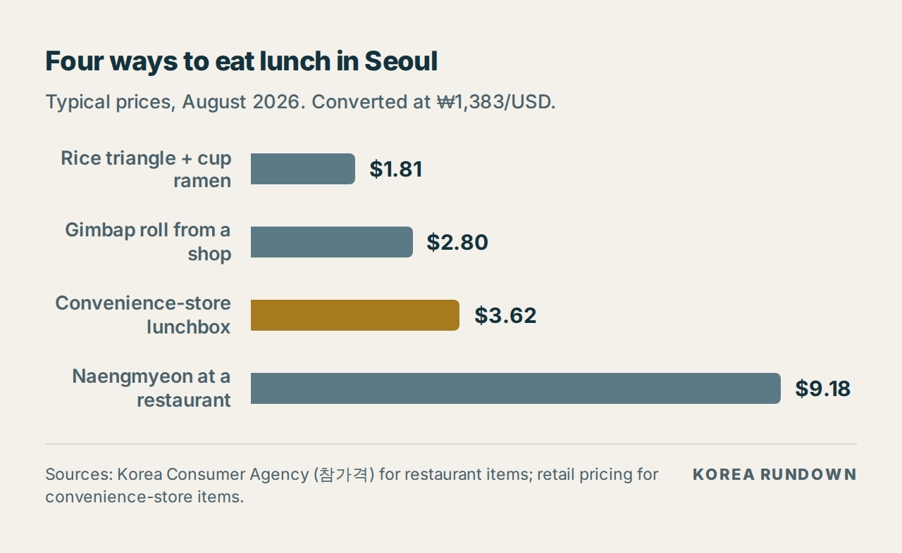
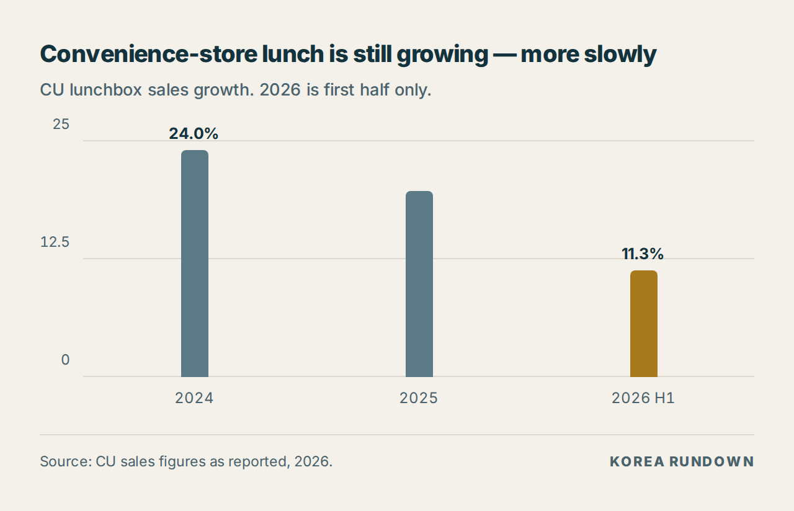

> ## ⚠️ 발행 전 반드시 읽어주세요 — 이 블록은 지우고 올리세요
>
> **1차 출처 확인이 필요합니다.** 검색은 되지만 기사 원문을 열 수 없는 환경에서 작성했습니다.
>
> 확인해야 할 곳:
> - **편의점 도시락 평균가(약 5,000원)와 가격대 분포**(4,000~6,000원 비중 CU 93.0% ·
>   이마트24 약 91% · 세븐일레븐 89.5% · GS25 85.3%) — 업계 집계 보도 기준입니다
> - **도시락 매출 증가율** — CU 2024년 24.0%, 2025년 19.7%, 2026년 상반기 11.3% /
>   세븐일레븐 20%·20%·15%. 각 사 발표 원문 확인 필요
> - **삼각김밥 가격대(1,200~1,900원)** — 브랜드·크기별 편차가 커서 대표값 확정이 필요합니다
> - **컵라면 1,200원** — 2편(농심 8월 1일 인상 후 육개장사발면 소매가)에서 가져온 값입니다
> - **미국 7-Eleven $6 Sandwich Meal Deal** — 로열티 회원가이고 프로모션이라
>   **발행 시점에 유효한지 반드시 재확인**하고, 확인일을 본문에 적으세요.
>   $3 로러그릴 콤보·$4 조식 콤보도 같은 이유로 변동 가능합니다
>
> **직접 확인하시면 가장 강해지는 부분:** 편의점 도시락 매대 사진, 온수기·전자레인지·
> 취식 공간 사진. 이 글의 핵심 주장(미국과 다른 건 가격이 아니라 구성과 설비)을
> 사진 한 장이 대신 증명합니다.

---

# What ₩10,000 Buys at a Korean Convenience Store (2026)

*Last updated: August 25, 2026 · Exchange rate used: ₩1,383 = $1 (August 24, 2026)*

₩10,000 is about **$7.23**. At a Korean convenience store that buys a hot rice
lunchbox, a cup of ramen, and you walk out with change. At the same chain in the
United States, $6 of that would be gone on one sandwich and a soda.

Korean office workers have a word for why this matters — *lunchflation* — and the
sales figures say they have already voted with it.

## The number

**₩5,000 — about $3.62 — for a convenience-store lunchbox.** That is the average, and
it is where the market has settled: roughly nine in ten lunchboxes sold fall in the
₩4,000–6,000 band.

## What ₩10,000 actually gets you

| Combination | Cost | Left over |
|---|---|---|
| Lunchbox + cup ramen | ₩6,200 ($4.48) | ₩3,800 |
| Two rice triangles + cup ramen | ₩3,800 ($2.75) | ₩6,200 |
| Value gimbap roll + cup ramen | ₩3,400 ($2.46) | ₩6,600 |

Component prices, August 2026:

| Item | Price |
|---|---|
| Lunchbox (도시락) | ~₩5,000 |
| Rice triangle (삼각김밥) | ₩1,200–1,900 |
| Value gimbap roll (CU 득템) | ₩2,200 |
| Cup ramen (Yukgaejang Sabalmyeon) | ₩1,200 |

> Cup ramen reflects Nongshim's August 1 increase — see the [ramen price
> piece](./2026-08-25-korea-ramen-price-freeze.md). Rice triangles run to ₩1,600–1,900
> for the oversized 2XL/3XL versions.

## Where it sits against everything else

| Lunch | Cost |
|---|---|
| Rice triangle + cup ramen | $1.81 |
| Gimbap roll from a shop | $2.80 |
| Convenience-store lunchbox | $3.62 |
| Naengmyeon at a restaurant | $9.18 |

The lunchbox is not the cheapest thing on the list. It is the cheapest thing that is
a *full cooked meal* — rice, a protein, and several sides, heated in front of you.

## Why Koreans are buying it

Restaurant prices did what [we covered last week](./2026-08-25-seoul-lunch-prices.md):
gimbap up 5.9% year on year, the fastest riser of the eight dishes tracked. A
sit-down lunch in a business district now routinely clears ₩10,000. The convenience
store absorbed the difference.

| Chain | 2024 | 2025 | 2026 H1 |
|---|---|---|---|
| CU | +24.0% | +19.7% | +11.3% |
| 7-Eleven Korea | +20% | +20% | +15% |
| emart24 | ~+2% | ~+2% | ~+2% |

Note the shape rather than the headline: growth is still strongly positive but
**decelerating**. The shift to convenience-store lunch is not accelerating away — it
happened, and it is now consolidating.

## Korea vs the US: the same chain, different lunches

This is where the comparison stops being one-sided, and it is worth being straight
about it.

| | Korea | United States |
|---|---|---|
| Standard lunch offer | Rice lunchbox, ~₩5,000 | Hot sandwich + drink, $6 |
| In dollars | $3.62 | $6.00 |
| Cheapest hot combo | Rice triangle + cup ramen, $1.81 | Roller-grill item + chips + drink, $3 |

On price alone the gap is real but not dramatic — and at the very bottom, a US $3
roller-grill deal is competitive with anything in Seoul. The difference is not
mainly the number. It is **what the number buys**, and what the store does for you
afterwards:

- The Korean lunchbox is a **cooked rice meal**. The US equivalent at that price is a
  snack assembled into a combo.
- Korean stores have **hot-water dispensers, microwaves, and a counter or table to eat
  at**. The cup ramen is not something you carry home; it is lunch, on site, in ten
  minutes.
- That seating and equipment is the actual product. It is why the category could
  absorb a shift away from restaurants at all.

If you have only used American convenience stores, this is the part that does not
translate. The price is the smaller half of the story.

## What this means if you're visiting

- **A convenience store is a legitimate lunch**, not a fallback. Look for the
  refrigerated 도시락 case near the back.
- **Ask for it to be heated** — staff will microwave it. Hot water is free at the
  dispenser.
- **The value ranges** (CU 득템 and equivalents) sit around ₩1,100–3,000 and are the
  best price-to-food ratio in the store.
- **Rice triangles are a snack, not a meal.** Two plus a cup ramen is roughly one
  lunch.
- **Budget ₩6,000–7,000** for a comfortable convenience-store lunch with a drink,
  against ₩10,000+ for a sit-down meal.

## FAQ

**How much is a convenience store meal in Korea?**
About ₩5,000 ($3.62) for a lunchbox, or ₩3,400–3,800 ($2.46–2.75) for a rice-triangle
or value-gimbap combination with cup ramen.

**Can you eat inside Korean convenience stores?**
Most have a counter or small table, plus a microwave and a hot-water dispenser. This
is standard, not a premium feature.

**Is it cheaper than eating at a restaurant?**
Roughly half to a third. A restaurant naengmyeon runs $9.18 against $3.62 for a
lunchbox.

**Is it cheaper than a US convenience store?**
Yes, but less dramatically than you would expect — about $3.62 against $6 for the
standard meal deal at the same chain. What differs more is the composition: a cooked
rice meal versus a sandwich combo.

## Related

- [Seoul's Cheapest Lunch Is Now Its Fastest-Rising Price](./2026-08-25-seoul-lunch-prices.md) —
  what restaurant food costs, and why gimbap leads the increases
- [Korea's Ramen Prices Go Up in September — Except the One That Matters](./2026-08-25-korea-ramen-price-freeze.md) —
  cup noodles rose, packets were frozen
- Part 1: Why Korea Has a Convenience Store for Every 950 People

## Sources

- Convenience-store lunchbox pricing and price-band distribution, industry reporting, 2026
- CU, 7-Eleven Korea and emart24 lunchbox sales growth figures, as reported, 2026
- Nongshim August 1 cup-noodle price revision, as reported
- 7-Eleven US $6 Sandwich Meal Deal and $3 Roller Grill Meal Deal (loyalty pricing)
- Exchange rate: ₩1,383/USD, August 24, 2026

---

## 발행 체크리스트

- [ ] 위 경고 블록을 지웠다
- [ ] 도시락 평균가·가격대 분포를 원문에서 확인했다
- [ ] 각 사 매출 증가율을 확인했다
- [ ] 삼각김밥 대표 가격대를 확정했다
- [ ] **미국 7-Eleven 프로모션이 발행일에 유효한지 재확인하고 확인일을 적었다**
- [ ] 환율과 기준일이 본문 전체에서 하나로 통일돼 있다
- [ ] 표를 이미지가 아니라 **HTML 텍스트 표**로 넣었다
- [ ] 이미지 3장에 alt 텍스트를 넣었다
- [ ] `og:image`를 `konbini-lunch-2026.png`로 지정했다
- [ ] Related 링크를 실제 발행 URL로 바꿨다
- [ ] **도시락 매대 · 온수기 · 전자레인지 · 취식 공간 사진을 넣었다** (이 글의 핵심 근거)
