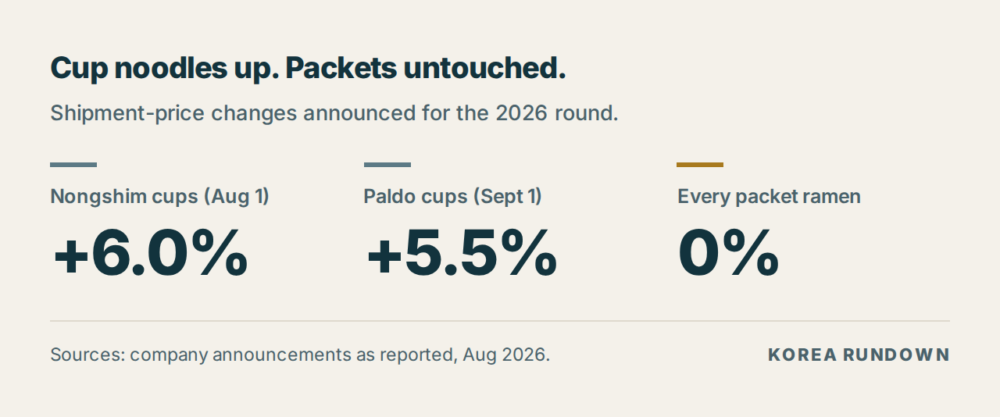
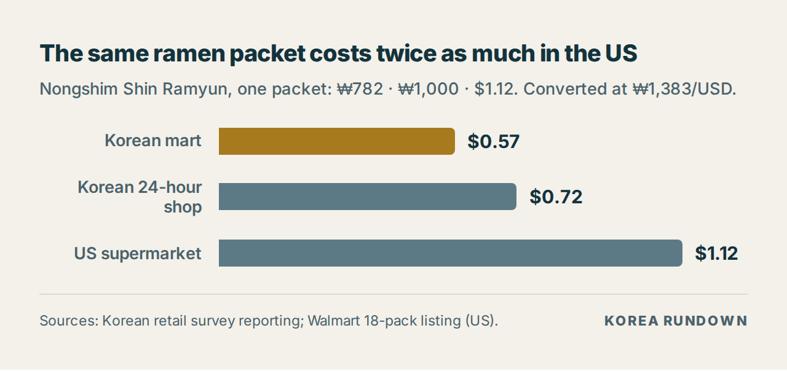

> ## ⚠️ 발행 전 반드시 읽어주세요 — 이 블록은 지우고 올리세요
>
> **1차 출처 확인이 필요합니다.** 이 초고를 작성한 환경에서는 검색은 되지만
> **기사·공시 원문 페이지를 열 수 없어서**, 아래 수치는 검색 결과를 교차 대조한 것입니다.
>
> 확인해야 할 곳:
> - **각 사 보도자료** — 농심·오뚜기·팔도의 인상 품목 수, 인상률, 시행일
> - **삼양식품이 정말 전 품목 동결인지** — 기사 한 곳에 의존한 부분입니다
> - **신라면 봉지 소매가(₩782~820 / 편의점 ₩1,000)** — 이 수치는 **2025년 기준 보도**에서
>   나온 것입니다. 이번 라운드에서 봉지면이 동결됐으니 유효할 가능성이 높지만,
>   2025년 중 7~10% 인상이 있었다는 보도도 있어 **현재가 확인이 꼭 필요합니다.**
>   가능하면 `price.go.kr` 참가격 가공식품 또는 대형마트 시세로 확정하세요.
> - **미국 가격($1.12/봉지)** — Walmart 18개들이 리스팅 기준입니다. 소매 시세라
>   수시로 바뀌니 발행 시점에 다시 확인하고, 확인일을 본문에 적으세요.
>
> **직접 확인하시면 가장 강해지는 부분:** 동네 마트·편의점에서 신라면 봉지 가격표를
> 찍어 넣으세요. 이 글의 핵심 숫자를 1차 경험으로 뒷받침할 수 있습니다.

---

# Korea's Ramen Prices Go Up in September — Except the One That Matters

*Last updated: August 25, 2026 · Exchange rate used: ₩1,383 = $1 (August 24, 2026)*

Three of Korea's four big ramen makers are raising prices this round. Nongshim went
first on August 1, Paldo follows on September 1, Ottogi on September 7. Samyang, the
company behind Buldak, is not raising anything.

But the headline number is the one that did **not** move. Every one of them left
**packet ramen** — the plastic-wrapped square you boil at home — completely alone.
The increases land on cup noodles only.

## The number

**0%.** That is the increase on packet ramen across all four makers, in a round where
cup noodles went up 5.5% to 6%.

## What changed

| Maker | Effective | What went up | How much |
|---|---|---|---|
| Nongshim | August 1 | 18 cup-noodle brands | +6.0% average (shipment) |
| Paldo | September 1 | 12 cup noodles, 9 beverages | +5.5% cups, +5.8% drinks (shipment) |
| Ottogi | September 7 | Cup ramen and dumplings | See retail examples below |
| Samyang | — | Nothing | — |

> Sources: company announcements as reported in Korean media, August 2026.

At the shelf, that works out to roughly ₩100 a cup:

| Product | Before | After |
|---|---|---|
| Yukgaejang Sabalmyeon (Nongshim) | ₩1,100 | ₩1,200 |
| Jin Ramen cup, spicy 110g (Ottogi) | ₩1,200 | ₩1,300 |
| Yeol Ramen cup 105g (Ottogi) | ₩1,200 | ₩1,300 |
| Chamkkae Ramen cup 110g (Ottogi) | ₩1,400 | ₩1,550 |

> Expected large-retailer prices as reported. Actual shelf prices vary by channel —
> a convenience store runs well above a hypermarket.

The stated cause is input costs: a weak won, swings in international oil prices, and
what those do to palm oil, flour, and the film and plastic that cup noodles are
packaged in. Note that last one. Packaging is a much bigger share of a cup's cost
than a packet's, which is part of why the cup is where the increase landed.

## Why the packet was spared

Ottogi's exclusion is the most striking: packet ramen is roughly **60% of its ramen
revenue**, and it left all of it untouched. That is not a rounding decision.

Packet ramen in Korea is a price with symbolic weight. It is the reference point for
"cheap meal" the way a coffee price or a subway fare is elsewhere — the thing
newspapers write about when it moves, and a company that moves it first absorbs the
public reaction on behalf of the whole industry. Raising the cup instead gets most of
the margin with a fraction of the noise, because a cup noodle reads as convenience,
not as groceries.

If you have been in Korea a while, you have watched this pattern before. The packet
holds, and holds, and then every maker moves within a few weeks of each other.

## Korea vs the US: the same packet

Here is the comparison that surprises people, because it runs the other way from
restaurant food.

| Where | Price per packet | In dollars |
|---|---|---|
| Korean hypermarket | ₩782 | $0.57 |
| Korean convenience store | ₩1,000 | $0.72 |
| US supermarket (18-pack) | ₩1,549 | $1.12 |

> Nongshim Shin Ramyun, one packet. Korean prices from retail reporting; US price
> from a Walmart 18-pack listing. Converted at ₩1,383/USD.

The identical product costs about **twice as much** in an American supermarket as in a
Korean one — and a US bulk pack still runs above what a Korean 24-hour convenience
store charges, which is itself about 28% above hypermarket price.

That gap is *smaller* than the one for eating out, where a Seoul lunch runs about a
third of the American equivalent. Manufactured goods travel; restaurant labour and
rent do not. Shipping, import margin, and shelf space explain most of the difference,
and none of them apply to a bowl of noodles served across a counter in Seoul.

## What this means if you're here

- **Buy packets, not cups.** The price gap was already wide; this round widened it.
  A packet is roughly half the price of a cup, and that ratio just improved.
- **Hypermarket over convenience store** for anything you are not eating in the next
  ten minutes — about 28% on the same item.
- **Samyang products are the ones holding price** this round, if you are indifferent
  between brands.
- **Stock up before September 7** only if you were buying cups anyway. Packets are
  not moving.

## FAQ

**Is Korean ramen cheaper in Korea than in the US?**
Yes — about half the price for the same packet. A Shin Ramyun packet runs roughly
$0.57 at a Korean hypermarket against about $1.12 in a US supermarket bulk pack.

**Why are cup noodles going up but not packets?**
Cups carry more packaging cost, and packet ramen is a politically sensitive price in
Korea. Makers took the increase where it draws less attention.

**Will packet ramen go up later?**
Nothing has been announced. Historically the packet holds for a while and then
several makers move close together, so the freeze is best read as a delay rather
than a decision.

## Related

- [Seoul's Cheapest Lunch Is Now Its Fastest-Rising Price](./2026-08-25-seoul-lunch-prices.md) — what
  a restaurant meal costs, and why gimbap is rising faster than samgyetang
- Part 1: Why Korea Has a Convenience Store for Every 950 People

## Sources

- Company price announcements (Nongshim, Ottogi, Paldo), as reported in Korean media, August 2026
- Korean retail price reporting for Shin Ramyun packet pricing
- Walmart product listing, Nongshim Shin Ramyun 18-pack (US)
- Exchange rate: ₩1,383/USD, August 24, 2026

---

## 발행 체크리스트

- [ ] 위 경고 블록을 지웠다
- [ ] 각 사 보도자료로 인상률·시행일·품목 수를 확인했다
- [ ] 삼양식품 전 품목 동결을 확인했다
- [ ] **신라면 봉지 현재 소매가를 확인했다** (2025년 보도 기준이라 특히 중요)
- [ ] 미국 가격을 발행일 기준으로 다시 확인하고 확인일을 적었다
- [ ] 환율과 기준일이 본문 전체에서 하나로 통일돼 있다
- [ ] 표를 이미지가 아니라 **HTML 텍스트 표**로 넣었다
- [ ] 이미지 2장에 alt 텍스트를 넣었다
- [ ] `og:image`를 `ramen-freeze-2026.png`로 지정했다
- [ ] Related 링크를 실제 발행 URL로 바꿨다
- [ ] 마트·편의점 가격표 사진을 넣었다 (1차 경험)
