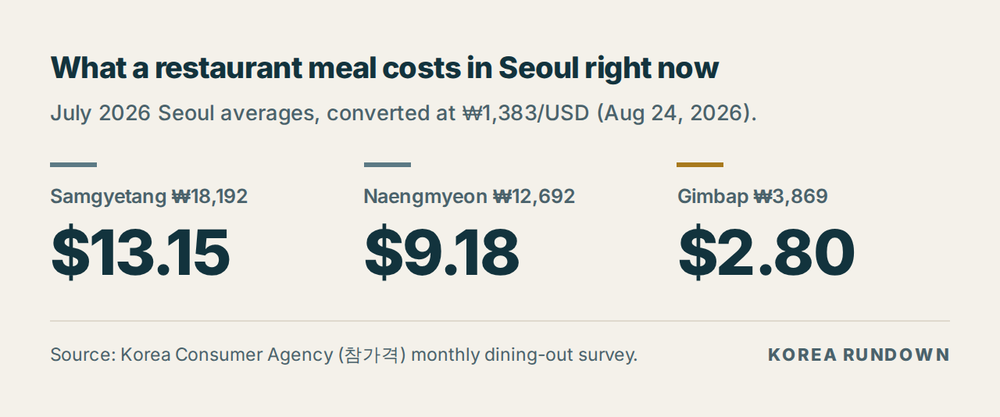
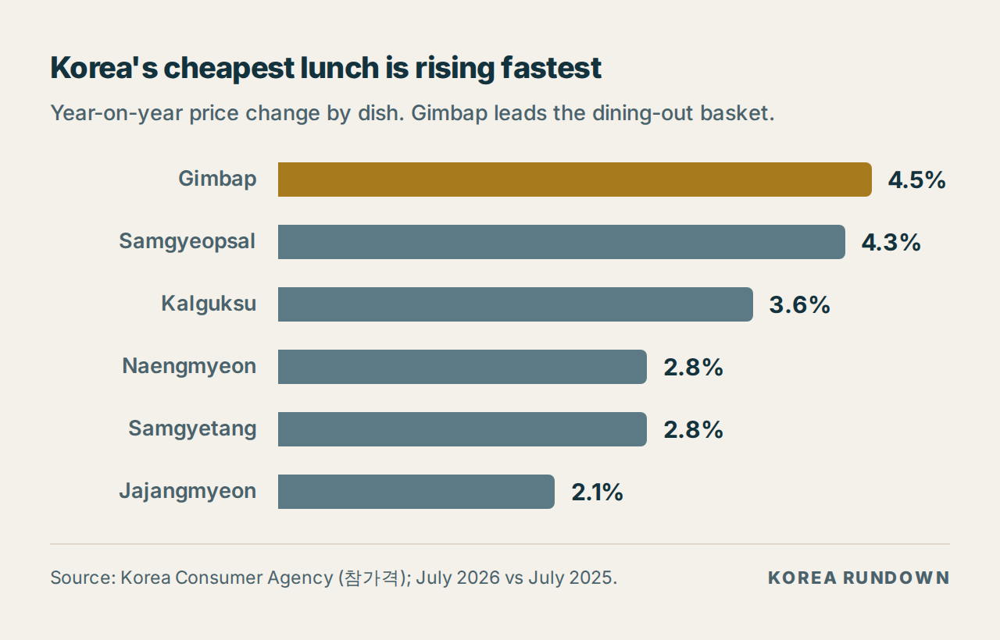
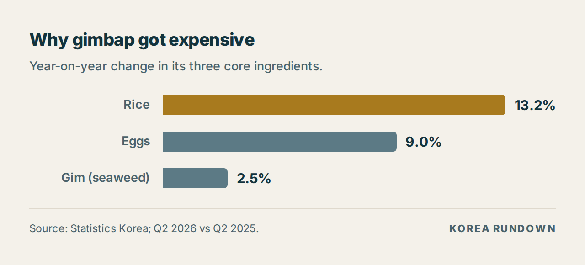

> ## ⚠️ 발행 전 반드시 읽어주세요 — 이 블록은 지우고 올리세요
>
> **모든 숫자를 1차 출처에서 확인하셔야 합니다.** 이 초고를 작성한 환경에서는
> 웹 검색은 가능했지만 **기사·통계 원문 페이지를 열 수 없었습니다**(egress 차단).
> 따라서 아래 수치는 전부 **검색 결과 요약을 교차 대조한 것**이고,
> 원문을 직접 확인한 것이 아닙니다.
>
> 확인해야 할 곳:
> - `price.go.kr` 참가격 → 서비스가격정보 → 외식비 (2026년 7월, 서울) — 삼계탕·냉면·김밥 평균가
> - `kostat.go.kr` 2026년 7월 소비자물가동향 — 품목별 등락률, 쌀·계란·김 상승률
> - `bls.gov` CPI (2026년 7월) / `ers.usda.gov` Food Price Outlook — food away from home
> - 환율 기준일과 값 (본문 전체가 이 값 하나로 통일돼 있습니다)
>
> **특히 확인 필요:** 김밥 평균가가 자료마다 3,838원과 3,869원으로 엇갈립니다.
> 3,869원이 7월치로 보이고 3,838원은 그 이전 달 수치로 보이지만, 원문에서 확정하세요.
>
> 미국 패스트푸드 콤보 가격($9–11)은 **공식 통계가 아니라 업계 집계**입니다.
> 본문에도 그렇게 밝혀 뒀습니다. 더 단단한 근거를 원하시면 BLS Average Price 시리즈를
> 확인해 대체하세요.

---

# Seoul's Cheapest Lunch Is Now Its Fastest-Rising Price (2026)

*Last updated: August 25, 2026 · Exchange rate used: ₩1,383 = $1 (August 24, 2026)*

A roll of gimbap — the seaweed rice roll you grab from a corner shop when you have
seven minutes and ₩4,000 — now averages **₩3,869 in Seoul, about $2.80**. That is
the cheapest thing on this list, and it is also the item rising fastest: **up 4.5%
from a year ago**, ahead of every other dish in Korea's dining-out basket.

Here is the part that matters if you are planning a trip: even after that increase,
it is still roughly a third of what a comparable quick lunch costs in the US.

## The number

**₩3,869 — $2.80 — for one roll of gimbap.** Up 4.5% year on year.

## What a meal actually costs in Seoul

| Dish | Seoul average (July 2026) | In dollars | Change vs July 2025 |
|---|---|---|---|
| Samgyetang (ginseng chicken soup) | ₩18,192 | $13.15 | +2.8% |
| Naengmyeon (cold noodles) | ₩12,692 | $9.18 | +2.8% |
| Gimbap (one roll) | ₩3,869 | $2.80 | +4.5% |

> Source: Korea Consumer Agency (한국소비자원) *참가격* monthly dining-out survey,
> Seoul averages, July 2026. Converted at ₩1,383/USD.

The two summer dishes are the ones Koreans complain about — samgyetang crossing
₩18,000 makes the news every July. But the number that actually changes how you eat
is the last row. Gimbap is the floor of eating out in Korea. When the floor moves,
everything above it eventually follows.

## Korea's cheapest lunch is rising fastest

| Dish | Change vs July 2025 |
|---|---|
| Gimbap | +4.5% |
| Samgyeopsal (pork belly) | +4.3% |
| Kalguksu (knife-cut noodles) | +3.6% |
| Naengmyeon | +2.8% |
| Samgyetang | +2.8% |
| Jajangmyeon | +2.1% |
| Kimchi-jjigae | +1.8% |

> Source: Korea Consumer Agency (참가격), July 2026 vs July 2025.

This is the opposite of what you would expect. Cheap food is supposed to be sticky —
the ₩1,000 price point holds for years because breaking it is a marketing event.
Gimbap broke anyway.

## Why gimbap, specifically

Because gimbap is three ingredients in a trench coat, and all three went up.

| Ingredient | Change (Q2 2026 vs Q2 2025) |
|---|---|
| Rice | +13.2% |
| Eggs | +9.0% |
| Gim (dried seaweed) | +2.5% |

> Source: Statistics Korea (통계청).

A samgyetang shop can absorb a 13% rice increase across a ₩18,000 bowl. A gimbap
shop selling at ₩3,800 cannot. The cheaper the dish, the larger the share of its
price that is raw ingredient — so the cheapest food is the most exposed to
ingredient inflation, not the least.

There is a second wave coming from the manufacturers. CJ CheilJedang raised prices
on 27 products by an average of 8%; Nongshim raised ramen and snacks 5.8%; Ottogi
went 6.1% to 17%; Paldo raises noodle shipment prices 5.5% from September 1. Those
are shipment prices, which reach restaurant menus on a delay.

## Korea vs the US

Two things are true at once, and most coverage picks one.

**On inflation, the two countries are close.** Korea's overall consumer prices rose
**2.8%** year on year in July 2026. US *food away from home* rose about **3.4%** over
a comparable period, with BLS regional readings for July 2026 between 2.6% and 3.4%.
Korean restaurant prices are not running away faster than American ones — dish by
dish, they are rising at roughly the same rate or slower.

| | Korea | United States |
|---|---|---|
| Headline CPI, July 2026 | +2.8% y/y | — |
| Dining out / food away from home | +1.8% to +4.5% by dish | +2.6% to +3.4% by region |

> Sources: Statistics Korea, July 2026 CPI; Korea Consumer Agency (참가격);
> US Bureau of Labor Statistics regional CPI, July 2026; USDA Economic Research
> Service Food Price Outlook.

**On absolute price, they are not close at all.** A gimbap roll at $2.80 is a
complete, portable lunch. The nearest American equivalent — a fast-food combo — runs
roughly $9–11 depending on the city. That figure is an industry aggregate rather
than an official statistic, so treat it as a range, not a data point. Even at the
bottom of the range, Seoul's fastest-rising lunch is about a third of the price.

That is the honest version of "Korea is cheap": the *rate* of change is ordinary,
the *level* is not.

## What this means if you're visiting

- **Budget ₩5,000–7,000 for a fast lunch**, not ₩4,000. The convenience-store and
  gimbap-shop floor has moved.
- **Summer dishes are the expensive ones.** Samgyetang and naengmyeon are seasonal
  specialties priced accordingly; they are not what a normal weekday lunch costs.
- **The ₩10,000 sit-down lunch still exists** — kimchi-jjigae rose the least of any
  dish tracked, at 1.8%.
- **Expect another step up around September**, when the manufacturer price increases
  reach menus.

## FAQ

**Is Korea still cheap for food in 2026?**
Compared to the US, yes — a full quick lunch is around $3 versus roughly $9–11.
What has changed is that the cheapest tier is no longer effectively frozen.

**Why is gimbap rising faster than expensive dishes?**
Ingredients are a much larger share of a ₩3,800 item than a ₩18,000 one. Rice rose
13.2% year on year in the second quarter, and gimbap is mostly rice.

**Will prices keep rising through 2026?**
Several manufacturers have announced increases taking effect from September, and
those reach restaurant menus on a delay. The direction is up; the pace is the open
question.

## Related

- Part 1: Why Korea Has a Convenience Store for Every 950 People
- Part 2: What Food Delivery Actually Costs in Korea

## Sources

- Korea Consumer Agency (한국소비자원), *참가격* dining-out price survey, July 2026 — `price.go.kr`
- Statistics Korea (통계청), July 2026 Consumer Price Index — `kostat.go.kr`
- US Bureau of Labor Statistics, Consumer Price Index regional releases, July 2026 — `bls.gov`
- USDA Economic Research Service, Food Price Outlook — `ers.usda.gov`
- Exchange rate: ₩1,383/USD, August 24, 2026

---

## 발행 체크리스트

- [ ] 위 경고 블록을 지웠다
- [ ] 모든 수치를 1차 출처에서 확인했다
- [ ] 김밥 평균가(3,838 vs 3,869) 어느 쪽이 7월치인지 확정했다
- [ ] 환율과 기준일이 본문 전체에서 하나로 통일돼 있다
- [ ] 표를 이미지가 아니라 **HTML 텍스트 표**로 넣었다
- [ ] 이미지 3장에 alt 텍스트를 넣었다
- [ ] `og:image`를 `gimbap-price-2026.png`로 지정했다
- [ ] Related 항목을 실제 글 URL로 바꿨다
- [ ] 1차 경험 문장을 한 줄 이상 넣었다 (직접 사 먹은 가격, 동네 김밥집 등)
